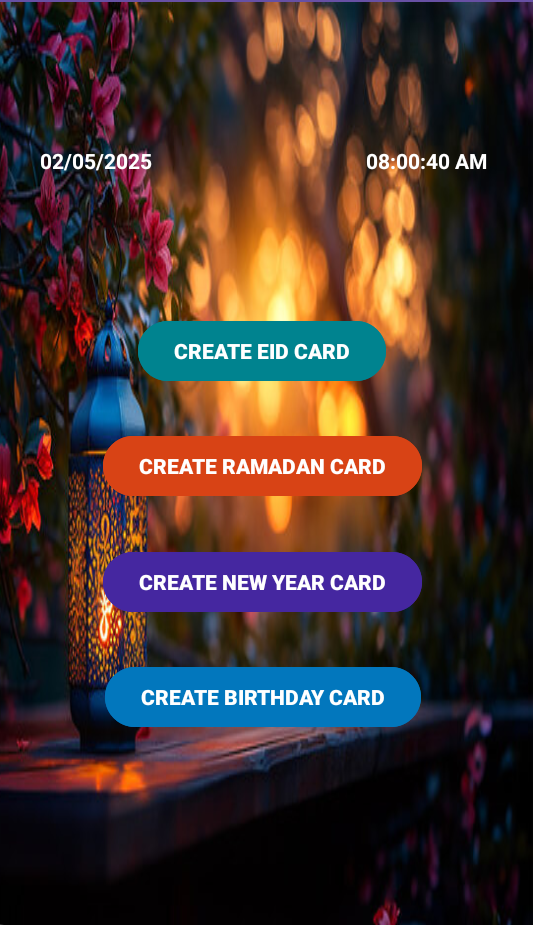
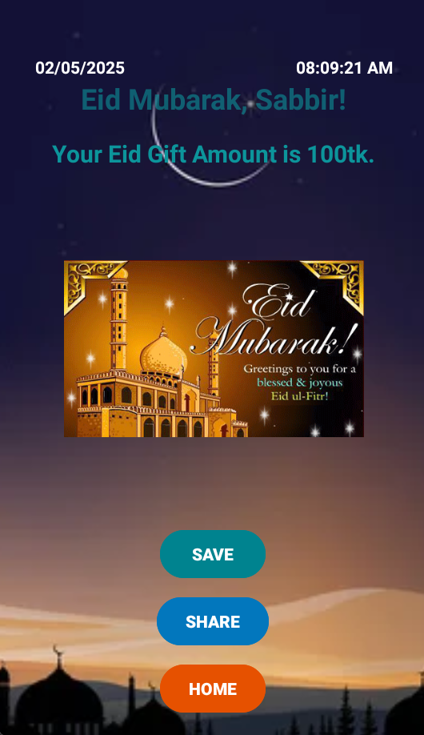
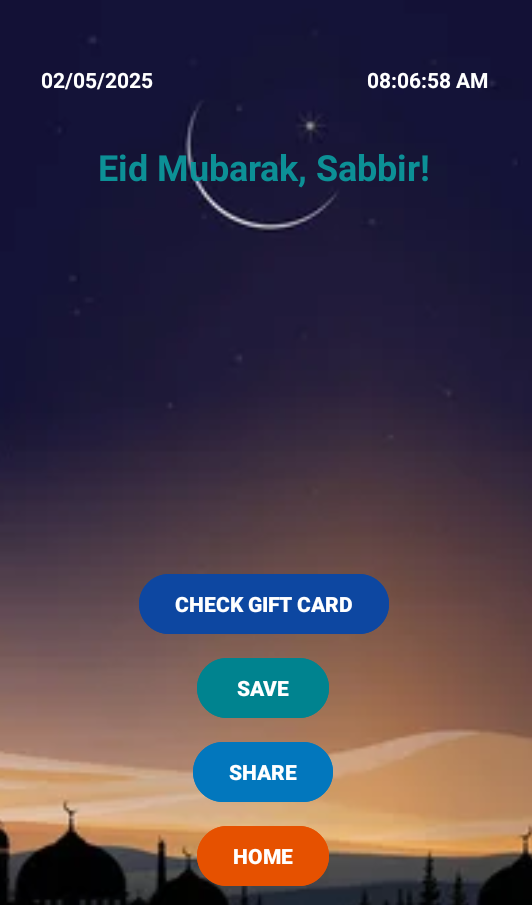

# ECardify 🎉  
**Animated E-Card App for Eid, Birthdays, and More!**

ECardify is an Android app that allows users to create and send beautifully animated e-cards for special occasions like **Eid**, **Ramadan**, **Birthdays**, and **New Year**. The app includes personalized messages, text-to-speech features, and a smooth UI experience.

---

## ✨ Features

- 🎨 Animated e-card interface
- 🗣️ Text-to-Speech integration (play/pause controls)
- 📝 Custom message input via EditText
- 📱 Responsive and colorful UI
- 📤 Share warm greetings with friends and family
- 🔄 Intent-based screen navigation

---

## 📸 Screenshots

| Home Screen | Eid Card | Text-to-Speech |
|-------------|----------|----------------|
|  |  |  | 

> _Replace screenshots with your actual images._

---

## 🛠 Built With

- Java (Android SDK)
- Android Studio
- Intent & Fragment APIs
- TextToSpeech API
- XML Layouts and View Animation

---

## 📂 Folder Structure

